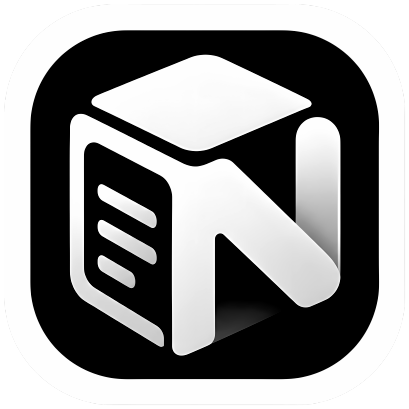
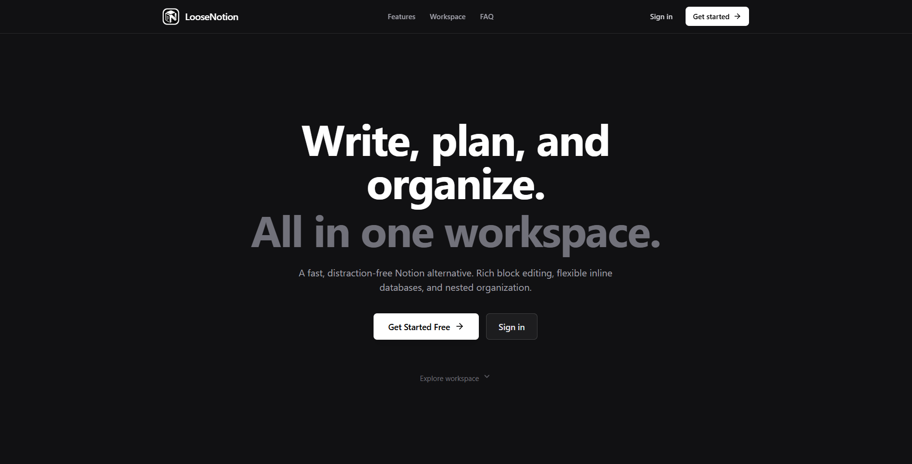
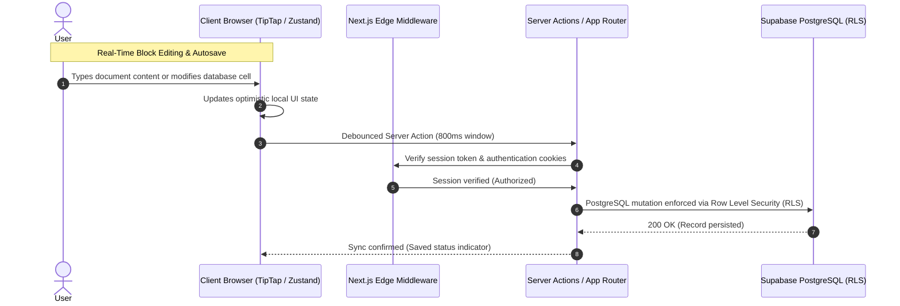

<p align="center">
  <a href="https://github.com/mizan989/LooseNotion-Notion_Clone">
    
  </a>
</p>

<div align="center">

# LooseNotion

### The open-source, distraction-free connected workspace for docs and inline databases. A lightweight, privacy-first alternative to Notion with zero telemetry, instant offline-grade speed, and complete user data ownership.

<br/>

<a href="#-quick-start"></a>
<a href="https://loosenotion.vercel.app"></a>
<a href="https://github.com/mizan989/LooseNotion-Notion_Clone/discussions"></a>

<a href="#-ways-to-run-loosenotion"></a>
<a href="https://loosenotion.vercel.app"></a>

<a href="https://github.com/mizan989/LooseNotion-Notion_Clone/stargazers"></a>
<a href="LICENSE"></a>
<a href="https://nextjs.org"></a>
<a href="https://www.typescriptlang.org"></a>
<a href="https://supabase.com"></a>
<a href="https://tailwindcss.com"></a>

</div>

> [!TIP]
> **Zero-Telemetry Workspace Ready!** Experience a high-speed, distraction-free document editor and inline database engine live at **[loosenotion.vercel.app](https://loosenotion.vercel.app)** — [Get started locally in under 60 seconds](#-quick-start).

---

## LooseNotion Overview

LooseNotion is a full-stack, open-source productivity platform and connected document workspace engineered as a high-performance, privacy-centric alternative to Notion. Built to eliminate the sluggish loading times, heavy background telemetry, and locked-in proprietary data formats of modern enterprise productivity tools, LooseNotion delivers the essential superpowers of Notion—flexible block-based editing, nested document trees, inline relational databases, and keyboard-first command palettes—in a focused, local-first architecture.

Every document, table schema, and database record is stored in your own **Supabase PostgreSQL** database protected by database-level **Row Level Security (RLS)**. With zero advertising trackers, instant 0ms SVG logo rendering, debounced background persistence, and one-click data exports in standard Markdown and JSON, LooseNotion gives you complete creative freedom and absolute data ownership.

**Key Capabilities:**

- **Block-Based Rich Text Engine** — Powered by TipTap & ProseMirror with slash commands (`/`), task checklists, code blocks, callouts, and inline styling
- **Inline Relational Databases** — Create typed multi-property databases (Text, Select tags, Date, Checkboxes) embedded directly into your workspace notes
- **Recursive Hierarchical Page Tree** — Unlimited parent-child document nesting with fluid drag-and-drop page reordering via `@dnd-kit`
- **Instant Debounced Autosave** — Optimistic local UI updates paired with debounced Next.js Server Actions (800ms window) for seamless real-time syncing
- **Enterprise Row Level Security (RLS)** — Granular database-engine security policies ensuring complete workspace isolation across user accounts
- **Zero-Delay Data Portability** — One-click workspace exports into standard Clean Markdown (`.md`) and raw hierarchical JSON bundles
- **Distraction-Free Editorial Aesthetics** — Curated dark mode (`#111113`), smooth Lenis inertial scrolling, glassmorphic surfaces, and subtle spring micro-interactions

<br>

<div align="center">
  <pre>
┌─────────────────────────────────────────────────────────────────────────────────┐
│                                   LOOSENOTION                                   │
│            Write ➔ Organize ➔ Filter ➔ Connect ➔ Export ➔ Focus                 │
├───────────────────────────────┬─────────────────────────────────────────────────┤
│  📝 Block-Based Document Canvas│  📊 Inline Relational Databases                 │
│   • TipTap & ProseMirror core │    [Project Roadmap / Tasks]                    │
│   • Slash commands (/) & lists│       ├── Multi-type columns (Text, Select, Date)│
│   • Auto-save debounce (800ms)│       └── Real-time inline cell editing & tags  │
├───────────────────────────────┼─────────────────────────────────────────────────┤
│  🌲 Nested Workspace Tree     │  🛡️ Row Level Security & Privacy                │
│   • Unlimited page hierarchy  │    • PostgreSQL RLS authentication via Supabase │
│   • @dnd-kit drag reordering  │    • Zero third-party telemetry or ad-trackers  │
└───────────────────────────────┴─────────────────────────────────────────────────┘
  </pre>
</div>

---

## UI Preview

<p align="center">
  
</p>


---

## Data Synchronization Flow



---

## Use Cases

- **Personal Knowledge Management (PKM)** — Organize interconnected second-brain notes, daily journals, and personal reference libraries
- **Product Roadmaps & Sprint Backlogs** — Manage software features, bug trackers, and milestones with dynamic multi-tag inline databases
- **Engineering Docs & Code Snippet Vaults** — Write technical RFCs and documentation with formatted code blocks, callouts, and numbered lists
- **Meeting Minutes & Decision Logs** — Document team agendas, meeting notes, action items, and task checkboxes with instant recall
- **Distraction-Free Creative Writing** — Focus purely on composition within a minimalist, quiet luxury workspace devoid of intrusive popups

---

## 🚀 Quick Start

**Prerequisites:**
- Node.js 18.x or higher (tested on Node.js v20 and v24)
- npm, pnpm, or yarn
- A free [Supabase](https://supabase.com/) account (provides PostgreSQL database, Auth, and RLS)

### Installation & First Run

```bash
# 1. Clone the repository
git clone https://github.com/mizan989/LooseNotion-Notion_Clone.git
cd LooseNotion-Notion_Clone

# 2. Install dependencies
npm install

# 3. Configure environment variables
cp .env.local.example .env.local

```

Edit `.env.local` with your Supabase credentials:

```env
NEXT_PUBLIC_SUPABASE_URL=https://your-project-id.supabase.co
NEXT_PUBLIC_SUPABASE_ANON_KEY=your-supabase-anon-key
SUPABASE_SERVICE_ROLE_KEY=your-supabase-service-role-key
```

### 4. Database Setup & Migrations

In your Supabase project dashboard, navigate to the **SQL Editor**, create a new query, and run the SQL migration script located at:

```sql
-- Copy and run contents of:
supabase/migrations/0001_init.sql
```

This provisions:
- Core tables: `workspaces`, `pages`, `blocks`, `databases`, `database_columns`, `database_rows`
- Database triggers for automated timestamps
- PostgreSQL Row Level Security (RLS) policies guaranteeing workspace isolation

### 5. Start Development Server

```bash
npm run dev
```

Open **[http://localhost:3000](http://localhost:3000)** in your browser to start using LooseNotion.

> [!NOTE]
> LooseNotion authenticates via Supabase Auth (Email OTP or Google OAuth). To enable Google OAuth, add your Google Client ID and Secret in your Supabase Dashboard under **Authentication ➔ Providers ➔ Google**.

---

## Ways to Run LooseNotion

- **Live Cloud Production** — Hosted on Vercel with serverless edge rendering and Supabase PostgreSQL. [Try Live App](https://loosenotion.vercel.app)
- **Local Full-Stack Development** — Runs locally with Next.js App Router, hot-module replacement, and your own Supabase instance. [Quick Start](#-quick-start)
- **Self-Hosted Deployment** — Deploy as a containerized Node.js application or static bundle via Docker, Coolify, or VPS.

---

## ☁️ Workspaces & Views

LooseNotion delivers purpose-built interfaces tailored for the modern documentation and knowledge workflow:

- **Interactive Landing & Showcase (`/`)** — High-converting landing page highlighting core architectural advantages, feature breakdowns, and live workspace demo preview.
- **Document Studio & Active Canvas (`/workspace/[pageId]`)** — Full-width or centered block editor with custom cover banners, emoji icons, breadcrumb navigation, and real-time save status.
- **Inline Relational Database Studio** — Embedded database canvas supporting customizable columns, tag management, real-time cell editing, and row deletion.
- **Hierarchical Sidebar & Page Tree** — Dynamic nested navigation tree supporting unlimited sub-pages, drag-and-drop reordering, favorites drawer, and workspace switching.
- **Global Command Palette (`Ctrl+K` / `⌘K`)** — Lightning-fast keyboard-first modal dialog to instantly search across all document titles and open pages.
- **Authentication Gateway (`/login` & `/signup`)** — Clean, secure auth portal with Google OAuth and email sign-in options.
- **Legal & Privacy Suites (`/privacy` & `/terms`)** — Transparent documentation detailing user data ownership, zero-telemetry commitments, and intellectual property rights.

---

## ✨ Features

### Block-Based Document Canvas (TipTap & ProseMirror)

- **Slash Commands (`/`)** — Type `/` anywhere on a blank line to instantly summon the block creation palette:
  - **Headings** — Heading 1 (`/h1`), Heading 2 (`/h2`), Heading 3 (`/h3`)
  - **Lists** — Bulleted lists (`/bullet`), Numbered lists (`/number`), Task checklists (`/todo`)
  - **Code Blocks** — Syntax-ready monospace blocks with syntax indentation (`/code`)
  - **Quotes & Callouts** — Emphasized blockquotes (`/quote`) and highlighted tip callouts
  - **Dividers & Media** — Visual section dividers (`/divider`) and image embeds
- **Markdown Shortcuts** — Seamless inline auto-formatting (`# `, `## `, `- `, `1. `, `[] `, ```` ``` ````).
- **Interactive Drag Handles** — Smooth block reordering handles on hover for intuitive canvas rearrangement.

### Inline Relational Databases

- **Multi-Type Columns** — Customize your table schema with:
  - **Text** — Free-form strings, descriptions, and labels
  - **Select** — Color-coded status badges, categories, and priority tags
  - **Date** — Deadline tracking and schedule pickers
  - **Checkbox** — Boolean completion indicators
- **Live Inline Cell Editing** — Edit cell values directly without opening modal sheets.
- **Dynamic Schema Modifications** — Add new columns, rename fields, and delete properties on the fly.

### Recursive Document Hierarchy

- **Infinite Page Nesting** — Create sub-documents inside parent documents to cleanly structure large wikis, documentation trees, and knowledge repositories.
- **Drag-and-Drop Organization** — Reorder pages and move documents between parent folders in the sidebar powered by `@dnd-kit`.
- **Personalized Page Accents** — Pick custom emoji icons and gradient cover headers for every document.

### Zero Lock-In & Complete Data Portability

- **One-Click Markdown Export** — Export any document directly to clean, standard GitHub Flavored Markdown (`.md`).
- **Full Workspace JSON Backup** — Download your complete document tree and database records in structured JSON for offline archiving.

### Modern Full-Stack Tech Stack

| Layer | Technologies |
|---|---|
| **Frontend Framework** | Next.js 14 (App Router, Server Components, Server Actions) |
| **Language** | TypeScript 5.0 (Strict mode enabled) |
| **Rich Text Engine** | TipTap 2.6, ProseMirror, StarterKit, Custom Block Extensions |
| **Styling & Design System** | Tailwind CSS 3.4, Radix UI Primitives, Lucide Icons |
| **Smooth Motion & Animation**| Framer Motion, Lenis Smooth Scroll |
| **Drag & Drop** | `@dnd-kit/core`, `@dnd-kit/sortable`, `@dnd-kit/utilities` |
| **Backend & Persistence** | Supabase (PostgreSQL 15, Auth, Row Level Security) |
| **State Management** | Zustand 4.5 |
| **Hosting & Edge** | Vercel (Edge Middleware, Serverless Functions) |

---

## ⚙️ Configuration

### Environment Variables (`.env.local`)

| Variable | Description | Required |
| :--- | :--- | :--- |
| `NEXT_PUBLIC_SUPABASE_URL` | Your Supabase project URL (`https://xyz.supabase.co`) | **Yes** |
| `NEXT_PUBLIC_SUPABASE_ANON_KEY` | Public anonymous key for client-side queries | **Yes** |
| `SUPABASE_SERVICE_ROLE_KEY` | Server-only administrative key for backend Server Actions | **Yes** |

---

## Architecture & Code Structure

```text
loosenotion/
├── actions/                   # Next.js Server Actions (pages, blocks, databases, workspace)
│   ├── blocks.ts              # Block creation, batch updates, ordering
│   ├── databases.ts           # Schema definitions, row mutations, cell updates
│   ├── pages.ts               # Page creation, hierarchy, favorites, deletion
│   └── workspace.ts           # Workspace provisioning and user memberships
│
├── app/                       # Next.js App Router (pages, layouts, API endpoints)
│   ├── (auth)/                # Authentication route group (login, signup)
│   ├── (workspace)/           # Protected workspace routes
│   │   ├── layout.tsx         # Workspace wrapper with sidebar & tree hydration
│   │   └── workspace/
│   │       ├── page.tsx       # Workspace default index view
│   │       └── [pageId]/      # Dynamic active page & database editor
│   ├── api/                   # REST API routes (blocks, databases, pages)
│   ├── auth/callback/         # Supabase OAuth redirect handler
│   ├── privacy/page.tsx       # Privacy Policy legal document
│   ├── terms/page.tsx         # Terms of Service legal document
│   ├── layout.tsx             # Root HTML layout, metadata, favicon & font configuration
│   └── page.tsx               # Public landing page entrypoint
│
├── components/                # React UI component architecture
│   ├── database/              # Relational database table views, cells, headers
│   ├── editor/                # TipTap block editor, slash menu, drag handles
│   ├── landing/               # Hero section, feature grids, interactive demo view
│   ├── legal/                 # Shared legal page layout & table of contents
│   ├── page/                  # Page title input, cover picker, icon selector
│   ├── search/                # Global Command Palette (Ctrl+K) search modal
│   ├── sidebar/               # Workspace switcher, page tree, export menu, favorites
│   └── ui/                    # Reusable design tokens (buttons, modals, LooseNotionLogo)
│
├── lib/                       # Core shared business logic
│   ├── client/                # Supabase browser client, tailwind utils
│   ├── editor/                # TipTap extension registry & editor configuration
│   ├── server/                # Supabase SSR client, server queries, auth helpers
│   └── constants.ts           # Application constants & default schemas
│
├── stores/                    # Zustand client state stores (sidebar, editor, database)
├── supabase/                  # PostgreSQL migrations and seed scripts
│   └── migrations/            # SQL migration scripts (0001_init.sql)
│
└── public/                    # Static assets (optimized logo.png, logo.svg, favicons)
```

---

## ☁️ Cloud Deployment

Deploy your own LooseNotion instance to Vercel with one click:

[](https://vercel.com/new/clone?repository-url=https%3A%2F%2Fgithub.com%2Fmizan989%2FLooseNotion-Notion_Clone)

### Deploying via Vercel CLI

```bash
# 1. Install Vercel CLI
npm i -g vercel

# 2. Deploy to production
vercel --prod
```

Configure your environment variables in the Vercel Dashboard under **Project Settings ➔ Environment Variables**.

---

## Verification & Quality Bar

```bash
# Typecheck TypeScript code
npm run typecheck

# Run ESLint validation
npm run lint

# Build production bundle
npm run build
```

---

## Contributing

We welcome community contributions! Whether you're adding new TipTap block extensions, expanding database view layouts (e.g. Kanban boards, Calendars), or refining mobile responsiveness:

1. Fork the repository
2. Create your feature branch (`git checkout -b feature/kanban-database-view`)
3. Commit your changes (`git commit -m 'Add Kanban board view for inline databases'`)
4. Push to the branch (`git push origin feature/kanban-database-view`)
5. Open a [Pull Request](https://github.com/mizan989/LooseNotion-Notion_Clone/pulls)

---

## Support the Project

**Enjoying LooseNotion?** Give us a ⭐ on [GitHub](https://github.com/mizan989/LooseNotion-Notion_Clone) to help others discover a fast, distraction-free, open-source productivity workspace!

---

## Acknowledgements

LooseNotion is built on the shoulders of outstanding open-source engineering:

- [Next.js](https://nextjs.org/) & [React](https://react.dev/) — Modern React framework and server architecture
- [TipTap](https://tiptap.dev/) & [ProseMirror](https://prosemirror.net/) — Headless, extensible rich-text block editing engine
- [Supabase](https://supabase.com/) — Scalable PostgreSQL database, authentication, and Row Level Security
- [Tailwind CSS](https://tailwindcss.com/) — Modern utility-first styling engine
- [Radix UI](https://www.radix-ui.com/) — Accessible, unstyled UI primitives
- [Lucide Icons](https://lucide.dev/) — Consistent, high-fidelity UI iconography
- [Framer Motion](https://www.framer.com/motion/) — Fluid spring physics and UI micro-interactions
- [Lenis](https://lenis.darkroom.engineering/) — Butter-smooth inertial scrolling experience

<div align="center">

> [!NOTE]
> **Data Ownership & Trademark Disclaimer:** LooseNotion is an independent open-source software project created to provide a lightweight, privacy-focused alternative for personal and team productivity. "Notion" is a registered trademark of Notion Labs, Inc. LooseNotion is not affiliated with, endorsed by, or sponsored by Notion Labs, Inc. You retain 100% intellectual property ownership over all content, documents, and databases created inside LooseNotion.

</div>
