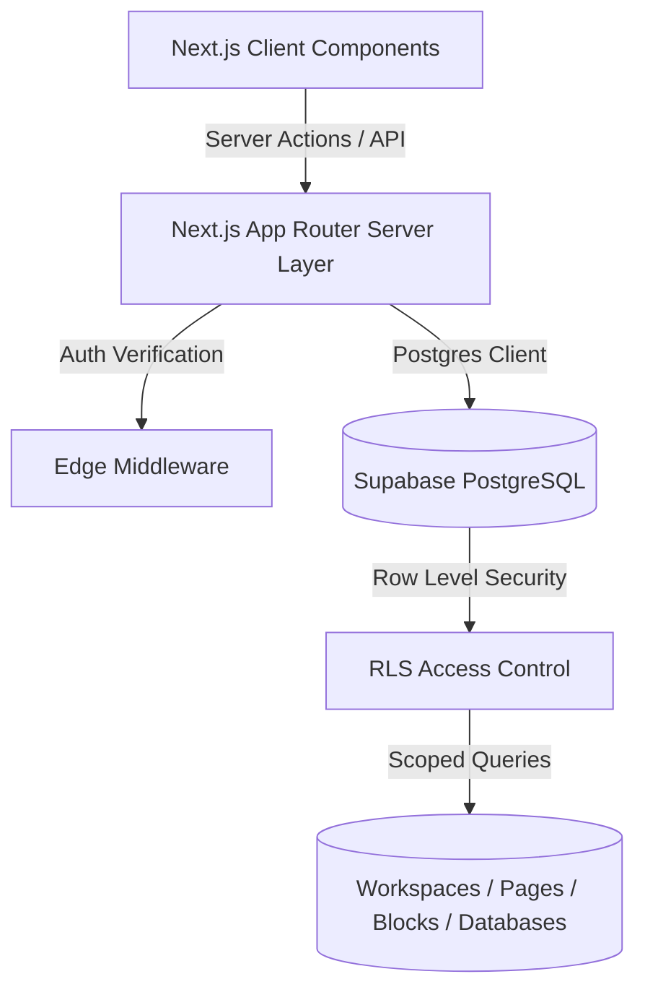

# LooseNotion — Full-Stack Notion Workspace Clone

[](https://loosenotion.vercel.app)
[](https://nextjs.org/)
[](https://www.typescriptlang.org/)
[](https://supabase.com/)
[](https://tailwindcss.com/)

A full-stack, Notion-inspired collaborative productivity platform featuring a block-based rich text editor, recursive nested page hierarchy, multi-view relational databases, and enterprise-grade Row Level Security (RLS) authentication.

---

## Live Demo

Experience the live application deployed on Vercel:
**[https://loosenotion.vercel.app](https://loosenotion.vercel.app)**

---

## UI Preview


---

## Key Features

### 1. Block-Based Rich Text Editor
- Built on **Tiptap** and **ProseMirror** with custom node views and extensions.
- **Slash Commands (`/`):** Instant quick-action palette to insert Headings (H1–H3), bullet/numbered lists, todo checklists, code blocks, blockquotes, callouts, dividers, and images.
- **Interactive Drag Handles:** Custom ProseMirror drag-handle extension allowing fluid block reordering.
- **Markdown Shortcuts:** Native auto-formatting for headers, bold, italics, code inline, and lists.
- **Real-Time Autosave:** Debounced Next.js Server Actions with clean save status indicators (`Saving...` / `Saved`).

### 2. Hierarchical Workspace & Page Tree
- **Recursive Nesting:** Unlimited parent-child page nesting managed through an optimized relational tree structure.
- **Drag-and-Drop Reordering:** Fluid page restructuring in the sidebar powered by `@dnd-kit`.
- **Customization:** Page emoji icons, gradient header covers, favorites, and recent documents.

### 3. Multi-View Relational Databases
- **Multiple Layout Views:** Switch between **Table View**, **Kanban Board View**, and **List View** on any database.
- **Dynamic Typed Columns:** Support for Text, Numbers, Single/Multi-Select dropdowns, Checkboxes, and Date pickers.
- Real-time row addition, inline cell editing, and column reordering.

### 4. Search & Keyboard Navigation
- **Global Command Palette (`Ctrl+K` / `Ctrl+P`):** Fast client-side title lookup combined with server-side full-text search across document contents.
- **Theme Support:** Polished Dark, Light, and System themes powered by `next-themes`.
- **Document Export:** Instant export of workspaces to Markdown and JSON formats.

---

## Architecture & System Design



### Architecture Highlights
- **Server Actions & Edge Middleware:** Protected routes in `/workspace` are verified at the edge before route compilation, preventing unauthorized asset delivery.
- **Row Level Security (RLS):** Data security is enforced at the database engine level via PostgreSQL RLS policies ensuring users can strictly only access workspaces and pages where they are registered members.
- **Optimistic UI:** Fast client state updates for sidebar navigation and editor interactions, paired with debounced background persistence.

---

## Tech Stack

| Layer | Technology |
|---|---|
| **Framework** | Next.js 14 (App Router, Server Components, Server Actions) |
| **Language** | TypeScript |
| **Editor Engine** | Tiptap, ProseMirror, StarterKit |
| **Styling & UI** | Tailwind CSS, Radix UI primitives, Lucide React, Framer Motion |
| **Drag & Drop** | `@dnd-kit/core`, `@dnd-kit/sortable`, `@dnd-kit/utilities` |
| **Database & Auth** | Supabase (PostgreSQL, Supabase Auth, Row Level Security) |
| **Hosting** | Vercel (Frontend & Serverless API), Supabase Cloud (PostgreSQL) |

---

## Getting Started

### Prerequisites
- Node.js 18.x or higher
- A free [Supabase](https://supabase.com/) project

### 1. Clone & Install
```bash
git clone https://github.com/mizan989/LooseNotion-Notion_Clone.git
cd LooseNotion-Notion_Clone
npm install
```

### 2. Environment Configuration
Create a `.env.local` file in the project root:
```env
NEXT_PUBLIC_SUPABASE_URL=your_supabase_project_url
NEXT_PUBLIC_SUPABASE_ANON_KEY=your_supabase_anon_key
SUPABASE_SERVICE_ROLE_KEY=your_supabase_service_role_key
```

### 3. Database Migration
In your Supabase project dashboard, open the **SQL Editor** and run the migration script:
```sql
-- Run contents of:
supabase/migrations/0001_init.sql
```
This provision tables (`workspaces`, `pages`, `blocks`, `databases`, `database_columns`, `database_rows`), triggers, and RLS policies.

### 4. Run Development Server
```bash
npm run dev
```
Open [http://localhost:3000](http://localhost:3000) to start using LooseNotion.
